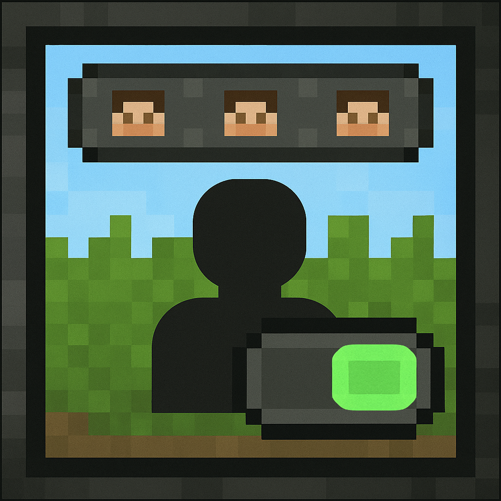
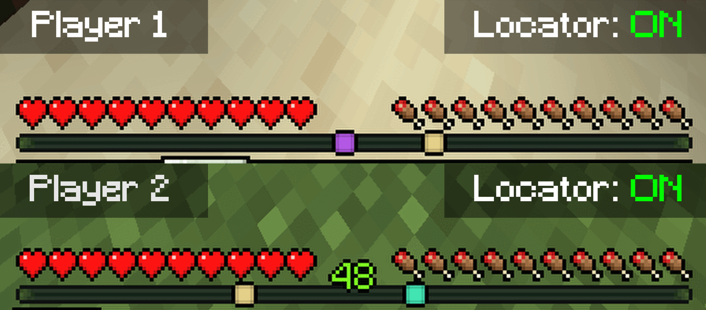

  

## 📋 Overview
LocatorToggle is a lightweight Spigot plugin that allows players to toggle the newly-introduced locator bar functionality locally. 
Doing so, will also hide said player from other players' locator bars, providing a more private gameplay experience.

❗ **Gamerule 'locatorBar' must be set to 'true'**

## 🎥 Demonstration

## 🛠️ Commands
- **/locator** - Toggles the locator bar functionality on/off for the player.

## 🔐 Permissions
| Permission node | Description                          | Default setting |
|-----------------|--------------------------------------|-----------------|
| locator.toggle  | Controls usage of the /locator command | Everyone        |

## 📄 License
This project is licensed under the [MIT license](LICENSE).
